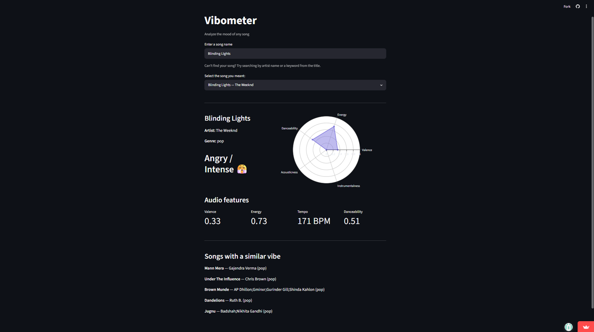

# Vibometer 🎵

Analyze the mood of any song using Spotify audio features.

**Live demo:** [Click here](https://vibometer-xbezncuz9yhsfkcnrgaskt.streamlit.app/)

---

## What it does

Vibometer lets you search any song and instantly see its mood — Happy, Melancholic, Hype, Chill, or Angry — based on audio features like valence, energy, tempo, and danceability. It also suggests similar songs with the same vibe.

## Screenshots



## Tech stack

- Python
- Streamlit — web interface
- Plotly — radar chart visualization
- Pandas — data processing
- Dataset: Spotify Tracks Dataset (Kaggle, 100k+ songs)

## How to run locally

```bash
git clone https://github.com/aayushiagarwal187/Vibometer.git
cd Vibometer
pip install -r requirements.txt
streamlit run app.py
```

## How mood is classified

Each song is classified based on its Spotify audio features:

| Mood | Valence | Energy | Tempo |
|------|---------|--------|-------|
| Happy 😊 | > 0.6 | > 0.5 | any |
| Melancholic 😔 | < 0.4 | < 0.5 | any |
| Hype 🔥 | any | > 0.8 | > 130 BPM |
| Chill 😌 | > 0.4 | < 0.4 | any |
| Angry 😤 | < 0.4 | > 0.7 | any |

## Built by

Aayushi Agarwal — B.Tech CSE (AI & Robotics), VIT Chennai